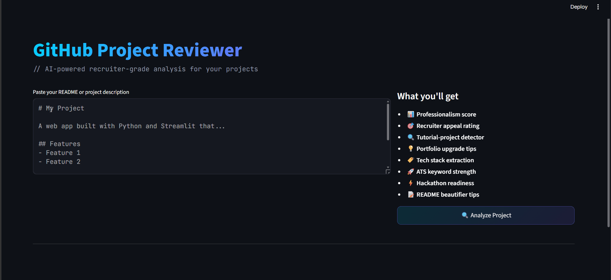

# 🔍 GitHub Project Reviewer — AI-Powered Portfolio Analyzer


> An AI-powered tool that analyzes GitHub project READMEs...

🔗 **Live Demo**: [github-project-reviewer.streamlit.app](https://ai-app-project-reviewer-se5svmfe6autuqdbr8wqca.streamlit.app/)

---

## 📸 Demo

🚀 **[Try it live →](https://ai-app-project-reviewer-se5svmfe6autuqdbr8wqca.streamlit.app/)**



---

## ✨ Features

| Feature | Description |
|---|---|
| 🎯 **Recruiter Mode** | Simulates a recruiter's first impression of your project |
| 🔍 **Tutorial Detector** | Flags if your project looks like a tutorial follow-along |
| 📊 **6-Dimension Scoring** | Professionalism, Hiring Appeal, Uniqueness, ATS, Hackathon, Docs |
| 🛠 **Tech Stack Extraction** | Detects 40+ technologies from your README |
| 🚀 **ATS Keyword Strength** | Checks for recruiter-friendly keywords |
| 💡 **Portfolio Upgrade Tips** | Actionable suggestions to make your project resume-worthy |
| 📝 **README Beautifier** | Tips on badges, wording, and structure |
| ⚡ **Hackathon Readiness** | Rates innovation and real-world impact potential |

---

## 🛠 Tech Stack

- **Frontend**: Streamlit
- **Visualization**: Plotly (Radar chart, Bar chart)
- **NLP**: TextBlob (sentiment analysis, subjectivity scoring)
- **Scoring Engine**: Custom rule-based NLP with keyword analysis
- **Data Collection**: GitHub REST API + Pandas

---

## 🚀 Getting Started

### Prerequisites
- Python 3.9+
- pip

### Installation

```bash
# 1. Clone the repository
git clone https://github.com/YOUR_USERNAME/github-project-reviewer.git
cd github-project-reviewer

# 2. Create a virtual environment
python -m venv venv
source venv/bin/activate        # On Windows: venv\Scripts\activate

# 3. Install dependencies
pip install -r requirements.txt

# 4. Download TextBlob corpora
python -m textblob.download_corpora

# 5. Run the app
streamlit run app.py
```

---

## 📁 Project Structure

```
github-project-reviewer/
├── app.py               # Streamlit UI — main application
├── analyzer.py          # NLP scoring engine (core logic)
├── dataset_creator.py   # GitHub API dataset builder
├── requirements.txt     # Python dependencies
├── .gitignore           # Git ignore rules
└── README.md            # This file
```

---

## 🧠 How the Scoring Works

The analyzer uses **rule-based NLP scoring** — no heavy ML model required:

1. **Section Detection** — regex scans for Installation, Usage, Features, etc.
2. **Tech Stack Extraction** — keyword matching across 40+ technologies
3. **Tutorial Detection** — flags common tutorial phrases and clone project names
4. **ATS Scoring** — checks for recruiter keywords (ML, API, deployment, etc.)
5. **Sentiment Analysis** — TextBlob subjectivity score for writing quality
6. **Weighted Aggregation** — combines all signals into 6 dimension scores

---

## 📊 Scores Explained

| Score | What It Measures |
|---|---|
| Professionalism | README quality, writing style, section completeness |
| Hiring Appeal | Resume-worthiness based on tech stack + deployment |
| Uniqueness | Originality vs. tutorial-clone detection |
| ATS Strength | Recruiter-relevant keyword density |
| Hackathon Ready | Innovation signals + real-world problem solving |
| Documentation | Depth and quality of project documentation |

---

## 🗂 Dataset

The `dataset_creator.py` script builds a dataset of 28 popular open-source repos using the GitHub API, capturing: stars, forks, topics, license, contributor count, open issues, README content, and more.

---

## 🤝 Contributing

Pull requests are welcome! If you find a bug or want to add a new feature:

1. Fork the repo
2. Create your feature branch (`git checkout -b feature/AmazingFeature`)
3. Commit your changes (`git commit -m 'Add AmazingFeature'`)
4. Push to the branch (`git push origin feature/AmazingFeature`)
5. Open a Pull Request

---

## 📄 License

Distributed under the MIT License. See `LICENSE` for more information.

---

## 👨‍💻 Author

Built as a Minor Project — *AI GitHub Project Reviewer*

---

*Made with ❤️ and Python*
